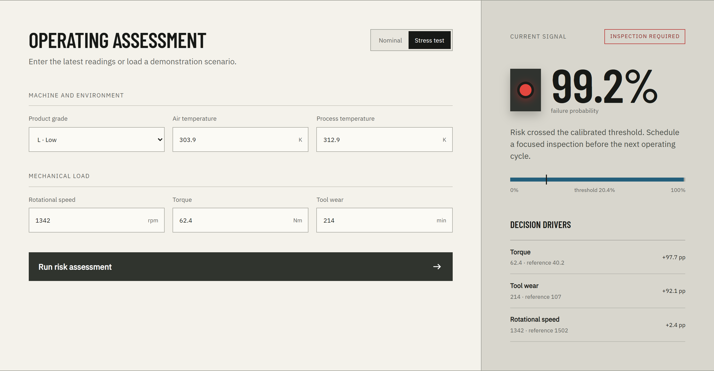
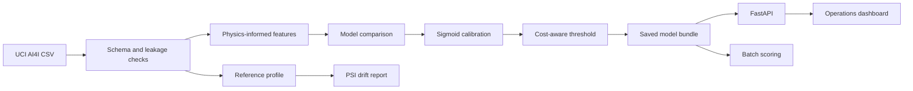
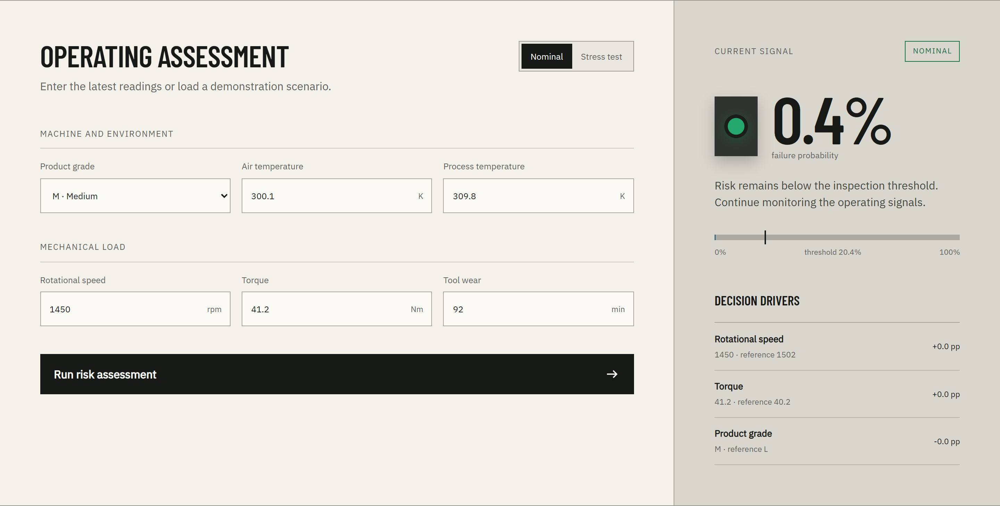
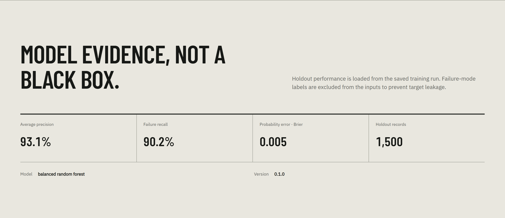
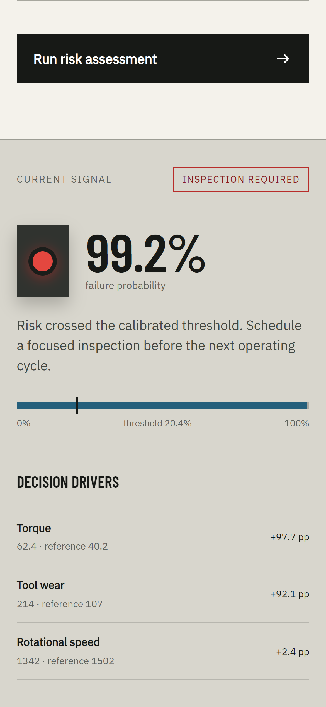
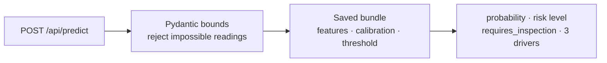
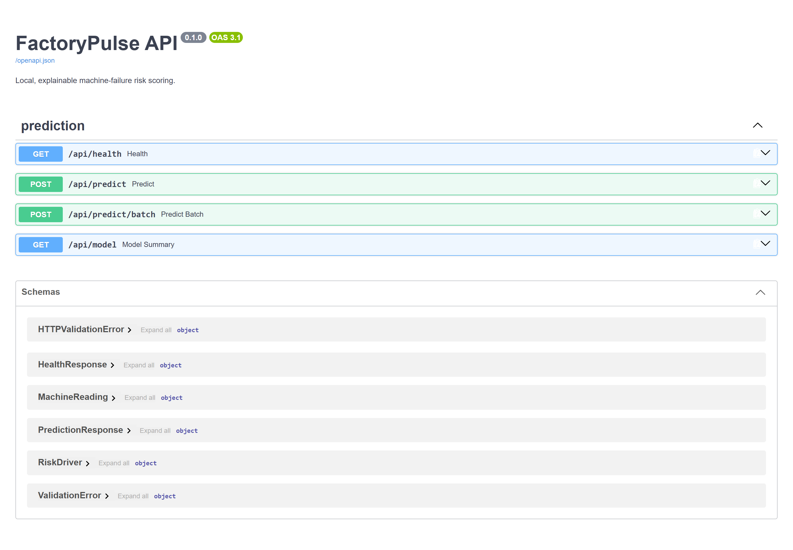

<div align="center">

# FactoryPulse

**Predictive maintenance that answers the only question the shop floor actually asks —
inspect this machine now, or keep running it — and shows you why.**

[](https://github.com/diegormirhan/factorypulse/actions/workflows/ci.yml)
[](pyproject.toml)
[](src/factorypulse/api.py)
[](src/factorypulse/modeling.py)

[](#running-it)
[](#running-it)
[](#running-it)
[](src/factorypulse/web/)
[](#verifying-it)

[What it decides](#the-question-it-answers) ·
[Architecture](#architecture) ·
[The threshold](#the-threshold-is-the-product) ·
[Results](#verified-results) ·
[Explanations](#explaining-one-prediction) ·
[Run it](#running-it) ·
[Limits](#known-limitations)

</div>

---

Stopping a machine to inspect it costs production. Not stopping it costs a breakdown. FactoryPulse
takes six operating readings — product grade, air and process temperature, rotational speed, torque
and tool wear — and turns them into a calibrated failure probability, a yes-or-no inspection
decision measured against an explicit cost threshold, and the measurements that moved the number.

Everything runs on one machine. No API key, no hosted model, no cloud service, no Streamlit
process, no JavaScript build tool.



*The right panel is the point. 99.2% is not the output — the output is **inspection required**,
because 99.2% crossed the 20.4% threshold that a cost function chose. Underneath, torque at 62.4 Nm
against a reference of 40.2 accounts for +97.7 percentage points of that risk. An alert nobody can
question is an alert nobody trusts.*

> **Scope:** portfolio and educational software trained on synthetic data. FactoryPulse is not a
> certified industrial safety system and must not be used as the sole basis for maintenance
> decisions.

---

## The question it answers

Most predictive-maintenance examples stop at a metric. That skips the part where the model has to
become a decision. FactoryPulse makes each of those steps visible and testable:

| Step | How it decides | Auditable? |
|---|---|---|
| Which columns may be used? | Failure-mode labels dropped — they reveal the target | ✅ |
| Which model wins? | Average precision on an untouched validation split | ✅ |
| Is 0.7 really 70%? | Five-fold sigmoid calibration, Brier-checked | ✅ |
| Inspect or not? | Threshold minimising a declared cost function | ✅ |
| Why this machine? | Deterministic feature counterfactuals, no LLM | ✅ |
| Which features matter overall? | Permutation importance on holdout data | ✅ |
| Has the incoming data shifted? | Population Stability Index per feature | ✅ |
| Does the number transfer to a real plant? | It does not — the data is synthetic | ⚠️ stated, not hidden |

Accuracy is absent on purpose. Only 3.39% of records are failures, so a model that answers "no
failure" every time scores 96.6% and is worth nothing.

---

## Architecture



One artifact carries everything inference needs: the calibrated estimator, the threshold, the
feature references used for explanations, and the metadata the dashboard displays. The API, the CLI
and the batch scorer all load that same bundle, so there is no path where the served model and the
evaluated model can drift apart.

See [Architecture](docs/ARCHITECTURE.md), [Model Card](docs/MODEL_CARD.md) and
[Data Card](docs/DATA_CARD.md) for the full design record.

---

## The threshold is the product

A classifier that returns 0.5 as its cutoff has quietly declared that a missed failure and a
needless inspection cost the same. They do not. FactoryPulse picks the threshold by minimising a
cost the repository states out loud:

```text
cost = (25 × false negatives + 1 × false positives) / validation samples
```

On the validation split that lands at **0.2042**. Every alert in the interface is measured against
that number, and the number lives in `config.yaml` where a reliability engineer can argue with it.

This does not claim a missed industrial failure costs exactly 25 inspections. It makes the
assumption explicit, testable and configurable — which is the whole difference between a model and
a decision.



*The same machine type under normal load. 0.4% risk, flat drivers, no inspection — and the threshold
marker sits exactly where it did at 99.2%. The decision moved; the policy did not.*

---

## Verified results

Selected and evaluated on a stratified 70/15/15 train/validation/test split, random seed 42.

| Holdout metric | Result |
|---|---:|
| Average precision | **0.9314** |
| ROC AUC | **0.9772** |
| Failure recall | **0.9020** |
| Precision | **0.8679** |
| F1 | **0.8846** |
| Brier score | **0.0048** |
| Inspection threshold | **0.2042** |
| Confusion matrix (`TN, FP / FN, TP`) | **1442, 7 / 5, 46** |

Read the last row instead of the first: across 1,500 held-out machines, **46 failures caught, 5
missed, 7 false alarms.** The random forest reached 0.8426 validation average precision against
0.3540 for the balanced logistic-regression baseline.



*The dashboard reads these from `artifacts/metrics.json` rather than from hardcoded copy, so the
interface cannot claim a number the training run did not produce.*

These describe one deterministic split of a synthetic dataset. They are not evidence of performance
on a real factory.

---

## Explaining one prediction

For a single reading, FactoryPulse replaces one feature at a time with its training reference,
rescores the counterfactual record, and reports the probability delta. No LLM, no sampling, no
run-to-run variance — ask twice, get the same answer.

The honest caveat: this measures **model sensitivity, not physical causality.** Correlated features
can share or mask importance, and the interface says so rather than dressing a delta up as a root
cause.

<details>
<summary><b>The same decision on a phone</b></summary>

<p align="center">
  
</p>

*Semantic HTML and CSS, no framework and no build step — the layout reflows because it was never
fighting a grid in the first place.*

</details>

---

## The API is the contract



```json
{
  "product_type": "L",
  "air_temperature_k": 303.9,
  "process_temperature_k": 312.9,
  "rotational_speed_rpm": 1342,
  "torque_nm": 62.4,
  "tool_wear_min": 214
}
```

The response carries the calibrated `failure_probability`, a categorical `risk_level`, the
`requires_inspection` decision, the saved threshold, the model version, and the three strongest
local drivers. Ranges are enforced by the schema, so a 900 K air temperature is a 422 and never a
prediction.

- `GET /api/health` — model readiness
- `GET /api/model` — metadata, holdout metrics, global importance
- `POST /api/predict/batch` — up to 1,000 typed readings per request



---

## Running it

Needs Python 3.12 and [uv](https://docs.astral.sh/uv/). The trained artifact ships with the
repository, so nothing has to be retrained to see it work:

```bash
git clone https://github.com/diegormirhan/factorypulse.git
cd factorypulse
uv sync --extra dev
uv run factorypulse serve
```

Then open <http://localhost:8000>, or <http://localhost:8000/docs> for the API.

### Rebuild every artifact

The source CSV is bundled under the dataset's CC BY 4.0 license. To fetch a fresh copy from UCI and
retrain from scratch:

```bash
uv run factorypulse download
uv run factorypulse train
```

Training writes the calibrated bundle to `artifacts/model_bundle.joblib`, selection and holdout
metrics plus permutation importance to `artifacts/metrics.json`, and the training distributions
drift monitoring compares against to `artifacts/reference_profile.json`.

### From the command line

```bash
# one reading
uv run factorypulse predict \
  --product-type L --air-temperature-k 303.9 --process-temperature-k 312.9 \
  --rotational-speed-rpm 1342 --torque-nm 62.4 --tool-wear-min 214

# a CSV batch — canonical snake_case or the original UCI headers
uv run factorypulse batch \
  --input data/sample/machines.csv --output artifacts/scored_machines.csv

# drift against the training reference
uv run factorypulse drift --input data/sample/drift_batch.csv
```

PSI is unreliable on small samples, so drift refuses to report on fewer than 100 readings rather
than returning a confident number it cannot support. Below 0.10 is stable, 0.10–0.25 warns, 0.25 and
above is critical — configured, not hardcoded.

### In Docker

```bash
docker build -t factorypulse .
docker run --rm -p 8000:8000 factorypulse
```

Splits, costs, threshold bounds, calibration folds, the random seed, PSI limits and API settings all
live in `config.yaml`, loaded and validated once at the application boundary.

---

## Verifying it

```bash
uv run ruff format --check .
uv run ruff check .
uv run pytest
```

**14 tests, 89% coverage.** They cover the schema and leakage boundary, feature engineering,
threshold selection, metrics, model serialisation, inference, PSI behaviour, API validation and
prediction responses. CI runs the identical three commands on every push and pull request.

The leakage test is the one that matters: it asserts the five failure-mode columns never reach the
estimator. Everything else in this repository is worthless if that assertion fails.

---

## What the model actually sees

| Feature | Meaning |
|---|---|
| `product_type` | Product quality grade: L, M or H |
| `air_temperature_k` | Ambient temperature in kelvin |
| `process_temperature_k` | Process temperature in kelvin |
| `rotational_speed_rpm` | Shaft speed in revolutions per minute |
| `torque_nm` | Applied torque in newton-metres |
| `tool_wear_min` | Accumulated tool wear in minutes |

Three more are derived deterministically inside the saved pipeline — temperature gap, mechanical
power, and wear-load index — because those are the quantities that fail, not the raw readings.
UDI, Product ID and all five failure-mode labels are excluded.

Candidates are a class-balanced logistic regression and a class-balanced random forest, each
calibrated with five-fold sigmoid calibration on the training partition only. Average precision on
the untouched validation partition picks the winner.

---

## Seeing it run

The dashboard is built for a two-minute walkthrough: model status and holdout evidence read from the
artifact, the **Nominal** scenario for a low-risk signal, **Stress test** for the same machine under
load, then the risk, the threshold and the three drivers changing together. Finally `/docs` for the
typed contract.

The bundled v0.1.0 artifact returns 0.9916 on the stress scenario; retraining can move that.

<details>
<summary><b>Repository layout</b></summary>

```text
factorypulse/
├── artifacts/                 # model, metrics, and drift reference
├── data/
│   ├── raw/                   # attributed UCI dataset
│   └── sample/                # batch and drift examples
├── docs/                      # architecture, cards, screenshots
├── src/factorypulse/
│   ├── acquisition.py         # reproducible UCI download
│   ├── data.py                # schema, normalization, leakage boundary
│   ├── features.py            # deterministic domain features
│   ├── modeling.py            # selection, calibration, evaluation
│   ├── inference.py           # scoring and local explanations
│   ├── monitoring.py          # reference profiles and PSI
│   ├── api.py                 # FastAPI routes
│   └── web/                   # dependency-free dashboard
└── tests/
```

</details>

---

## Known limitations

- **AI4I 2020 is synthetic.** It has no sensor noise, no maintenance interventions, no temporal
  dependence and no changing equipment population. Nothing here predicts real-plant behaviour.
- **The split is random, not chronological.** It estimates interpolation, not forward-in-time
  generalisation — the thing a deployment would actually need.
- **Counterfactual deltas are model sensitivity, not causality.** They explain the prediction, not
  the physics.
- **PSI detects distribution change, nothing more.** It does not find the root cause and does not
  prove the model got worse.
- **A real deployment needs more than this repository.** Time-based validation, site-specific cost
  elicitation, equipment-level grouping, data contracts, delayed-label monitoring, and human safety
  review.

---

## Stack

`scikit-learn 1.9` · `pandas 2.3` · `NumPy 2.5` · `FastAPI 0.141` · `Pydantic 2.13` ·
`Uvicorn 0.52` · `joblib 1.5` · semantic HTML/CSS/JavaScript · `uv` · Docker · GitHub Actions

No PyTorch, no Streamlit, no npm, no cloud, no API keys.

---

## Data attribution

Matzka, S. (2020). *AI4I 2020 Predictive Maintenance Dataset* [Dataset]. UCI Machine Learning
Repository. DOI: [10.24432/C5HS5C](https://doi.org/10.24432/C5HS5C). Licensed under
[CC BY 4.0](https://creativecommons.org/licenses/by/4.0/).

## License

Source code is released under the [MIT License](LICENSE). The dataset and bundled fonts retain their
own licenses; see `data/raw/README.md` and `LICENSES/`.

## Author

Built by [Diego Mirhan](https://diegomirhan.com) — [GitHub](https://github.com/diegormirhan) ·
[LinkedIn](https://www.linkedin.com/in/diegomirhan/).
