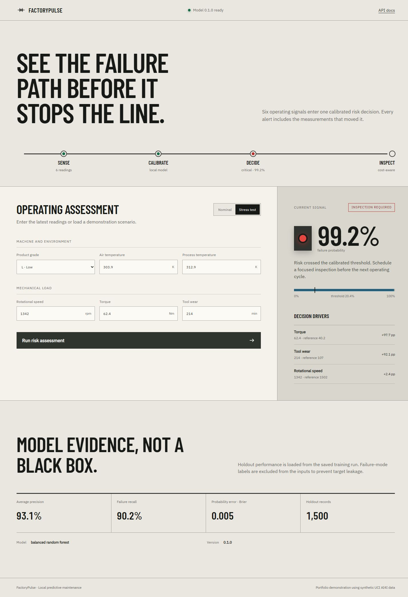
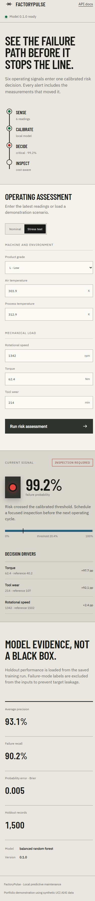
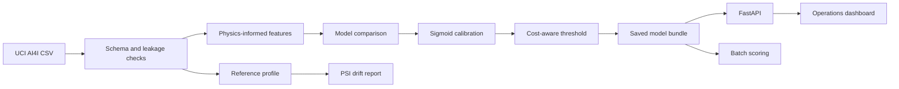

# FactoryPulse

FactoryPulse is an end-to-end, local predictive-maintenance system that turns six machine readings into a calibrated failure risk, an inspection decision, and a short explanation of the measurements that moved the prediction.

It is intentionally more than a notebook. The repository covers data acquisition, leakage-safe feature preparation, model comparison, probability calibration, cost-aware threshold selection, holdout evaluation, batch scoring, drift detection, a typed FastAPI service, and a responsive dashboard built for operational review.



<details>
<summary>Mobile interface</summary>

<p align="center">
  
</p>

</details>

> **Scope:** portfolio and educational software trained on synthetic data. FactoryPulse is not a certified industrial safety system and must not be used as the sole basis for maintenance decisions.

## Contents

- [Why this project](#why-this-project)
- [Verified results](#verified-results)
- [System flow](#system-flow)
- [Technology stack](#technology-stack)
- [Quick start](#quick-start)
- [Demo workflow](#demo-workflow)
- [Command line](#command-line)
- [API](#api)
- [Modeling details](#modeling-details)
- [Tests and quality checks](#tests-and-quality-checks)
- [Docker](#docker)
- [Limitations and next steps](#limitations-and-next-steps)

## Why this project

Predictive-maintenance examples often stop at accuracy. FactoryPulse makes the decisions around the model visible:

- failure-mode columns are removed because they directly reveal the target;
- average precision drives model selection because only 3.39% of records are failures;
- probabilities are calibrated before they are interpreted as risk;
- the alert threshold minimizes an explicit maintenance cost function;
- each prediction is explained with deterministic feature counterfactuals;
- permutation importance is calculated on unseen holdout data;
- incoming batches can be checked for Population Stability Index (PSI) drift.

Everything runs locally. No API key, hosted model, cloud service, Streamlit process, or JavaScript build tool is required.

## Verified results

The saved model was selected and evaluated with a stratified 70/15/15 train/validation/test split and random seed 42.

| Holdout metric | Result |
|---|---:|
| Average precision | **0.9314** |
| ROC AUC | **0.9772** |
| Failure recall | **0.9020** |
| Precision | **0.8679** |
| F1 | **0.8846** |
| Brier score | **0.0048** |
| Inspection threshold | **0.2042** |
| Confusion matrix (`TN, FP / FN, TP`) | **1442, 7 / 5, 46** |

The random forest reached 0.8426 validation average precision and outperformed the balanced logistic-regression baseline at 0.3540. These results describe one deterministic split of the synthetic AI4I dataset; they are not evidence of performance on a real factory.

## System flow



See [Architecture](docs/ARCHITECTURE.md), [Model Card](docs/MODEL_CARD.md), and [Data Card](docs/DATA_CARD.md) for the full design record.

## Technology stack

| Layer | Technology |
|---|---|
| Data and numerical computing | pandas, NumPy |
| Machine learning | scikit-learn |
| Model persistence | Joblib |
| API and validation | FastAPI, Pydantic |
| Server | Uvicorn |
| Interface | Semantic HTML, CSS, vanilla JavaScript |
| Package and environment management | uv |
| Testing and quality | pytest, pytest-cov, Ruff |
| Delivery | Docker, GitHub Actions |

## Quick start

### Requirements

- Python 3.12
- [uv](https://docs.astral.sh/uv/)

### Run the included trained model

```bash
git clone https://github.com/diegormirhan/factorypulse.git
cd factorypulse
uv sync --extra dev
uv run factorypulse serve
```

Open [http://localhost:8000](http://localhost:8000). Interactive API documentation is available at [http://localhost:8000/docs](http://localhost:8000/docs).

### Reproduce training

The source CSV is included under the dataset's CC BY 4.0 license. To download a fresh copy from UCI and rebuild every model artifact:

```bash
uv run factorypulse download
uv run factorypulse train
```

Training writes:

- `artifacts/model_bundle.joblib` — calibrated estimator, threshold, references, and metadata;
- `artifacts/metrics.json` — selection, holdout metrics, and permutation importance;
- `artifacts/reference_profile.json` — training distributions used by drift monitoring.

## Demo workflow

The dashboard is structured for a short screen recording:

1. Show the model status and holdout evidence loaded from the artifact.
2. Run the **Nominal** scenario to produce a low-risk signal.
3. Switch to **Stress test** and run the assessment again.
4. Observe the signal change, the 99% range risk, the 20.4% inspection threshold, and the three local decision drivers.
5. Open `/docs` to show the typed API contract.

The exact stress-test probability can change after retraining, but the bundled v0.1.0 artifact returns 0.9916.

## Command line

### Score one reading

```bash
uv run factorypulse predict \
  --product-type L \
  --air-temperature-k 303.9 \
  --process-temperature-k 312.9 \
  --rotational-speed-rpm 1342 \
  --torque-nm 62.4 \
  --tool-wear-min 214
```

### Score a CSV batch

```bash
uv run factorypulse batch \
  --input data/sample/machines.csv \
  --output artifacts/scored_machines.csv
```

The input accepts either the canonical snake-case headers shown in `data/sample/machines.csv` or the original UCI column names.

### Check drift

PSI is unreliable on tiny samples, so FactoryPulse requires at least 100 current readings.

```bash
uv run factorypulse drift --input data/sample/drift_batch.csv
```

Interpretation is configured in `config.yaml`: below 0.10 is stable, 0.10–0.25 is a warning, and 0.25 or more is critical.

## API

### `POST /api/predict`

```json
{
  "product_type": "L",
  "air_temperature_k": 303.9,
  "process_temperature_k": 312.9,
  "rotational_speed_rpm": 1342,
  "torque_nm": 62.4,
  "tool_wear_min": 214
}
```

The response contains the calibrated `failure_probability`, categorical `risk_level`, `requires_inspection` decision, saved threshold, model version, and the three strongest local drivers.

Additional endpoints:

- `GET /api/health` — model readiness;
- `GET /api/model` — model metadata, holdout metrics, and global importance;
- `POST /api/predict/batch` — up to 1,000 typed readings per request.

## Modeling details

### Inputs

| Feature | Meaning |
|---|---|
| `product_type` | Product quality grade: L, M, or H |
| `air_temperature_k` | Ambient temperature in kelvin |
| `process_temperature_k` | Process temperature in kelvin |
| `rotational_speed_rpm` | Shaft speed in revolutions per minute |
| `torque_nm` | Applied torque in newton-metres |
| `tool_wear_min` | Accumulated tool wear in minutes |

Three deterministic features are derived inside the saved pipeline: temperature gap, mechanical power, and wear-load index. UDI, Product ID, and all five failure-mode labels are excluded.

### Model selection and calibration

FactoryPulse compares a class-balanced logistic regression with a class-balanced random forest. Each candidate is calibrated through five-fold sigmoid calibration using only the training partition. Average precision on the untouched validation partition selects the winner.

### Threshold policy

The validation threshold minimizes:

```text
cost = (25 × false negatives + 1 × false positives) / validation samples
```

This does not claim that every missed industrial failure costs exactly 25 inspections. It makes the product assumption explicit, testable, and configurable.

### Explanations

For a single prediction, FactoryPulse replaces one feature at a time with its training reference, scores the counterfactual record, and reports the probability delta. The result is deterministic and easy to audit, but it is not a causal claim. Correlated features can share or mask importance.

## Configuration

All paths, split sizes, costs, threshold search bounds, calibration folds, random seed, PSI limits, and API settings live in `config.yaml`. Configuration is loaded and validated once at the application boundary.

## Tests and quality checks

```bash
uv run ruff format --check .
uv run ruff check .
uv run pytest
```

The verified suite contains **14 passing tests with 89% coverage**. It covers schema and leakage controls, feature engineering, threshold selection, metrics, model serialization, inference, PSI behavior, API validation, and prediction responses. CI runs the same checks on every push and pull request.

## Docker

The trained artifact is included, so the dashboard can start without retraining:

```bash
docker build -t factorypulse .
docker run --rm -p 8000:8000 factorypulse
```

## Repository structure

```text
factorypulse/
├── artifacts/                 # model, metrics, and drift reference
├── data/
│   ├── raw/                   # attributed UCI dataset
│   └── sample/                # batch and drift examples
├── docs/                      # architecture, cards, screenshots, LinkedIn draft
├── src/factorypulse/
│   ├── acquisition.py         # reproducible UCI download
│   ├── data.py                # schema, normalization, leakage boundary
│   ├── features.py            # deterministic domain features
│   ├── modeling.py            # selection, calibration, evaluation
│   ├── inference.py           # scoring and local explanations
│   ├── monitoring.py          # reference profiles and PSI
│   ├── api.py                 # FastAPI routes
│   └── web/                   # dependency-free dashboard
└── tests/
```

## Limitations and next steps

- AI4I is synthetic and does not capture sensor noise, maintenance interventions, temporal dependence, or changing equipment populations from a real plant.
- The random stratified split estimates interpolation performance, not forward-in-time generalization.
- Counterfactual deltas describe model sensitivity, not physical causality.
- PSI signals distribution change but does not identify the root cause or prove performance degradation.
- A real deployment would require time-based validation, site-specific cost elicitation, equipment-level grouping, data contracts, delayed-label monitoring, and human safety review.

## Data attribution

Matzka, S. (2020). *AI4I 2020 Predictive Maintenance Dataset* [Dataset]. UCI Machine Learning Repository. DOI: [10.24432/C5HS5C](https://doi.org/10.24432/C5HS5C). Licensed under [CC BY 4.0](https://creativecommons.org/licenses/by/4.0/).

## License

Source code is released under the [MIT License](LICENSE). The dataset and bundled fonts retain their own licenses; see `data/raw/README.md` and `LICENSES/`.

## Author

Built by [Diego Mirhan](https://diegomirhan.com) — [GitHub](https://github.com/diegormirhan) · [LinkedIn](https://www.linkedin.com/in/diegomirhan/).
