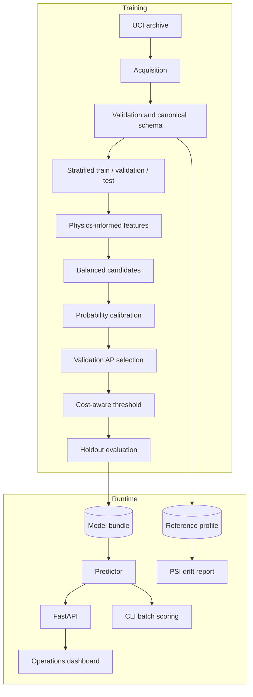

# Architecture

FactoryPulse keeps deterministic data and decision logic separate from serving and presentation. The model bundle is the only dependency shared by CLI and API inference.

## Boundaries

- `acquisition.py` knows the external UCI archive format.
- `data.py` owns the canonical feature contract and leakage boundary.
- `features.py` contains deterministic, serializable transformations.
- `modeling.py` orchestrates splitting, candidate comparison, calibration, thresholding, and artifact persistence.
- `evaluation.py` contains pure metric and cost-policy functions.
- `inference.py` loads the model once, scores records, creates deterministic local explanations, and writes JSONL audit entries.
- `monitoring.py` creates reference distributions and computes PSI on sufficiently large batches.
- `schemas.py` defines the public HTTP contract.
- `api.py` contains only HTTP composition and dependency wiring.
- `web/` consumes the API and never imports model logic.

## Artifact contract

`model_bundle.joblib` stores the calibrated scikit-learn estimator, threshold, reference values, model version, training timestamp, and evaluation summary. It must only be loaded from a trusted build because Joblib uses Python pickle semantics.

## Failure behavior

- Invalid feature values fail at the schema or data boundary.
- The API starts without a model so `/api/health` can report `model_missing`; scoring returns HTTP 503 until training is complete.
- Batch API requests are capped at 1,000 records.
- Drift analysis rejects fewer than 100 readings to avoid presenting unstable PSI estimates as evidence.

